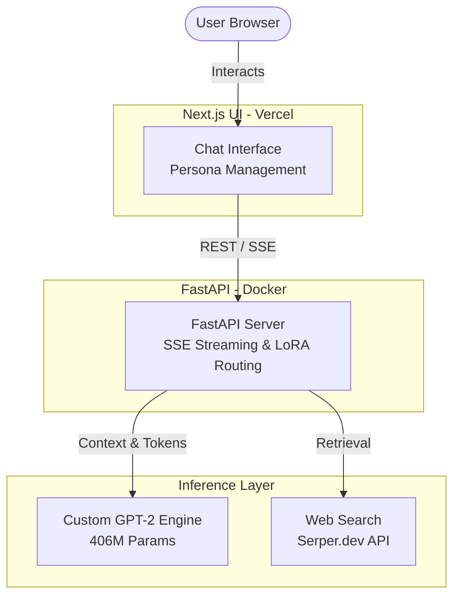

# GPT-2 From Scratch: Serving API & Next.js Playground

[](https://gpt-production-level.vercel.app)
[](https://python.org)
[](https://pytorch.org)
[](https://fastapi.tiangolo.com)
[](https://nextjs.org/)
[](LICENSE)

This project is a decoder-only transformer language model built entirely from scratch using PyTorch primitives, complete with a REST serving layer and a Next.js chat interface. 

*Built from scratch — no `transformers` library, no high-level wrapping. Features KV-Caching optimizations, LoRA hot-swapping, and grounded RAG search.*

---

## 1. System Architecture

The project decouples the Next.js frontend from the compute-heavy FastAPI model server.



---

## 2. Model & Inference Capabilities

### KV-Caching (Performance)
Standard transformers recalculate attention (Query, Key, Value) for all past tokens at every step ($O(t^2)$ latency). We implemented a **Key-Value Cache** that saves $K,V$ tensors for past tokens, passing only the single newest token into the model ($O(t)$ latency).

```mermaid
graph LR
    subgraph Pre-fill Phase
        P[Prompt] -->|Q,K,V Projection| Attn1[Compute Attention]
        Attn1 --> C1[(Store K,V in Cache)]
    end
    subgraph Decode Phase (Step t)
        T[New Token t] -->|Q,K,V Projection| Attn2[Compute Attention]
        C2[(Load K,V from Cache)] --> Attn2
        Attn2 --> C3[(Append new K,V to Cache)]
    end
    C1 -.-> C2
```

**Honest Benchmarks (Local CPU):**
- **GPT-2 Small (124M)**: ~21.4 tokens/second
- **GPT-2 Medium (406M)**: ~8.6 tokens/second

### Continuous Batching (Throughput)
Concurrent requests share forward passes. A scheduler thread keeps up to `ENGINE_MAX_BATCH` sequences in flight; between steps it admits waiting requests, prefills new prompts in one padded pass, then runs **one batched decode step for every active sequence**, each sampled with its own settings. Keys/values live in a preallocated slot cache (`model/kv_cache.py`) where a token's cache index equals its position, so sequences of different lengths batch without copying. Output is token-for-token identical to single-request generation (`tests/test_batching.py`), including past the context window. Weights and KV cache run in bf16/fp16 on GPU (`MODEL_DTYPE`).

Measured on 4 CPU cores, GPT-2 small size, 8 concurrent 64-token requests:

| Mode | Throughput | Worst-case latency |
|---|---|---|
| One request at a time (previous behavior) | 25.0 tok/s | 20.5 s |
| Continuous batching, 8 slots | **68.0 tok/s** (2.7×) | **7.5 s** |

**Multi-LoRA batching:** requests for different adapters, and the base model, share the same batch. Adapters live in a pool (`model/lora.py`, `ENGINE_MAX_ADAPTERS`, default 8) instead of being wired into the model. Each adapted projection adds the per-row update `B_i A_i x` for its own row's adapter, as one batched matmul over pool entries gathered by row (the S-LoRA/Punica approach). `alpha/r` is folded into `B`, and lower-rank adapters are zero-padded, so results are exact; `tests/test_batching.py` checks them against independent single-adapter models. Admission is FIFO: if every pool entry is pinned by running requests, the next request waits rather than evicting one in use.

| 8 concurrent 64-token requests (4 CPU cores, GPT-2 small size) | One adapter per batch (previous) | Multi-LoRA batching |
|---|---|---|
| Mixed traffic: adapter A, adapter B, base, interleaved | 24.5 tok/s, peak batch 1 | **60.0 tok/s**, peak batch 8 |
| Base model only | 68.0 tok/s | 67.5 tok/s |

### Dynamic LoRA Adapters
The backend hot-swaps LoRA (Low-Rank Adaptation) adapters at runtime without reloading the base model — used for the SFT instruction-tuning adapters (`sft_v1_small`/`sft_v1_medium`) and for adapters trained on-demand via Teach Mode (`/finetune`).

Instruction tuning (both `training/finetune_instruct.py` and Teach Mode) uses **prompt-masked loss**: only response tokens are supervised. Previously two-thirds of the supervised tokens in `data/sft_mix.jsonl` were the fixed template and the user's instruction. The template itself lives in one place (`data/sft.py`) and is shared by training and serving, so the prompt an adapter is trained on is byte-for-byte the prompt it is served with.

### Multi-Turn Conversations
The chat UI sends earlier turns as `history` (`[{role, content}, ...]`, oldest first). The server renders them as completed Instruction/Response blocks ahead of the current instruction, and a single-turn prompt stays byte-identical to the training template. When a conversation doesn't fit the context window, the oldest turns are dropped first; the current question and its web sources always take priority. SFT examples may carry the same context as `"history": [[user, assistant], ...]`, in which case only the final response is supervised. The shipped adapters were tuned on single-turn data, so they treat history as few-shot context until retrained on multi-turn examples.

Adapters are selected **per request** (`"adapter"` in the `/generate` body: omit it for the server default, `"none"` for the base model), so one user's choice never changes the model for anyone else. Every adapter is validated against the running model's architecture before use and applied all-or-nothing. Setting the server-wide default is an admin operation (see below).

### Personas (Prompt-Based)
Personas (*Socrates*, *Einstein*, *Shakespeare*) are prompt-engineering presets, not separate fine-tuned models — there are no persona-specific LoRA adapters. Selecting one applies a style-framing instruction prepended to the prompt plus a matching sampling-parameter preset (temperature, penalties, web search on/off). Quality depends on the base/SFT model's ability to follow the framing instruction, not on dedicated persona training.

### Grounded RAG Generation
When web search is enabled, the API:
1. Queries Serper.dev for live snippets.
2. Ranks and deduplicates snippets based on keyword overlap.
3. Pre-pends the snippets as context.
4. **Safety Net**: Computes extractive overlap on the generated answer; if overlap is near zero (hallucination), it prepends a direct quote from the sources.

### Security & Robustness
- **Admission control:** the batch scheduler has a bounded wait queue (`ENGINE_MAX_QUEUE`) — overload gets a fast `503` + `Retry-After` instead of piling up threads. A client disconnect cancels its request and frees the batch slot at the next step.
- **Non-blocking I/O:** web search and adapter loading run off the event loop.
- **Admin-only operations:** reading collected feedback and changing the server-default adapter require `Authorization: Bearer $ADMIN_API_KEY`, and are disabled when no key is set.
- **Abuse limits:** proxy-aware per-IP rate limits (`TRUSTED_PROXY_HOPS`), request body cap, bounded schemas, bounded caches and storage; Teach Mode cannot overwrite existing or shipped adapters.
- **Untrusted content:** user prompts and web snippets are tokenized with special tokens disabled (no `<|endoftext|>` injection); search-result links are restricted to `http(s)`; checkpoints load with `weights_only=True`.

All settings are documented in [`.env.example`](.env.example).

---

## 3. Project Structure & Testing

The system is covered by a `pytest` suite of **111 unit and integration tests**, including regression tests for each fix above (`tests/test_security.py`) that run against a real uvicorn server where client disconnects matter.

```
GPT-PRODUCTION-LEVEL/
├── app/                  # FastAPI server, inference engine, RAG search
├── model/                # PyTorch primitives (attention, layers, lora, gpt)
├── frontend/             # Next.js App Router (React)
├── data/                 # Datasets & tokenization utilities
├── training/             # Pre-training and LoRA fine-tuning scripts
├── evals/                # Eval harness: perplexity, multiple choice, behavior checks
├── tests/                # 111 unit & integration tests
└── checkpoints/          # Base models and adapter states
```

### Evaluation

`python -m evals` scores a checkpoint (plus an optional adapter) through the same engine and prompt builder the API serves with:

| Suite | What it measures |
|---|---|
| `heldout` | Response-only loss and perplexity on `data/sft_eval.jsonl`, masked exactly like SFT |
| `mc` | 32 multiple-choice questions scored by answer log-likelihood (raw and per-token normalized) — a stable signal even when generations are weak |
| `behavior` | 24 greedy generations checked by rules: factual recall, instruction following, chitchat, multi-turn memory, RAG answers over *invented* facts (only the sources can answer), plus hygiene on every output (template leakage, empty, failure to stop, repetition) |

```bash
python -m evals --checkpoint checkpoints/best_model.pt --adapter sft_v1_small --out reports/sft_v1_small.json
# Gate a change: exit 1 if a gated metric regresses past its tolerance
python -m evals --checkpoint checkpoints/best_model.pt --adapter sft_v1_small --baseline evals/baselines/small-sft_v1_small.json
```

Reports record eval-data hashes and decoding settings; comparing against a baseline built on different data or settings is refused (exit 2) rather than reported as a regression. The **Model Eval** workflow (Actions → *Run workflow*) runs the harness on real GPT-2 weights and gates against `evals/baselines/<size>-<adapter>.json` when one is committed.

---

## 4. Setup & Running

**Prerequisites:** Python 3.10+, Node.js 18+

### Backend (FastAPI)
```bash
# Setup and activate virtual environment
python -m venv venv
venv\Scripts\activate  # Windows

# Install requirements
pip install -r requirements-dev.txt

# Start FastAPI serving backend
python -m uvicorn app.api:app --reload --port 8000
```

### Frontend (Next.js)
```bash
cd frontend
npm install
npm run dev
```

---

## 5. Limitations & Reality Check

While this is a robust system, it is built for educational/portfolio purposes and is not a replacement for commercial LLMs:
- **CPU Bottleneck**: The backend currently targets CPU deployment (e.g. Hugging Face free tier). Real-world systems run on GPUs via Triton/vLLM.
- **Model Size**: 406M parameters is very small. It struggles with complex logical reasoning without RAG grounding.
- **Batching**: Continuous batching and multi-LoRA batching are implemented, but prefill and decode share a step (a long prompt delays everyone's next token), and there is no paged attention or custom CUDA kernels -- the pieces vLLM-class servers add on top.
- **Generation Quality**: The custom LoRA finetuning on Cosmopedia text introduces style shifts but does not eliminate hallucinations entirely.

---

## 👨‍💻 About the Author

**Amogh Samadhiya** — *Backend & MLOps Engineer*

Final-year B.Tech student specializing in ML Systems, Distributed Systems, and Production MLOps.

| **Production Stack** | FastAPI • Docker • Kubernetes • MLflow • Apache Airflow • AWS • Python • C++17 |
| :--- | :--- |

**Connect & Collaborate:**
* 📧 **Email**: [amoghsamadhiya779@gmail.com](mailto:amoghsamadhiya779@gmail.com)
* 🔗 **LinkedIn**: [amogh-samadhiya](https://www.linkedin.com/in/amogh-samadhiya-8890b82b8/)
* 💼 **Availability**: *Open to remote Backend / ML Engineering internships and opportunities.*
